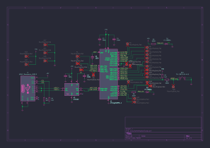
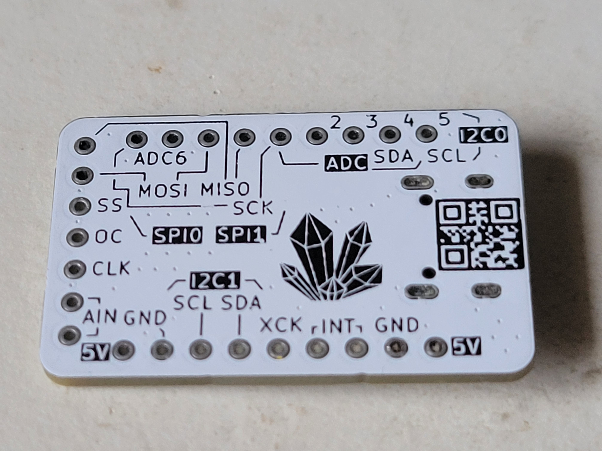

# Arduinomethyste

## Summary of the project

Arduinomethyste is a printed circuit board (PCB) based on the ATMega328PB from Atmel. It is the more recent version of the ATMega328P used in the Arduino Uno. The goal of this project is to design a minimalist but functional board compatible with the Arduino framework.

## Schematics

## Features

- USB-C with USB-UART converter (CH340N) for the serial communication Computer-ATMega328PB
- BOOT button to configure the firmware and RESET the board
- Power red LED indicating a proper 5V rail (USB or pins)
- Green LED linked to a PWM of the ATMega328PB to control its light intensity
- Expose every pins except PD5 (used by the green LED) and the RESET (a mistake to correct)
- Expose power pins (5V and GND)

## Components and making

The board was conceived to be assembled by JLCPCB, the components references are theirs and the constraints of the Kicad projects are adapted to JLCPCB limitations.

Fortunately, the board doesn't require controled impedance (the USB trace are very short), the sizes and spacing (traces and vias) being generous, it is totally feasible to make this board with other fabricators (Aisler, OshPark, PCBWay). The components references just need to be adjusted accordingly (be aware of footprints variation) to the fabricator or the distributor (Mouser, Digikey), if you assemble the board yourself.

## Board results :

## Firmware and Arduino programming
By default, the ATMega328PB chips don't the contain the firmware required for the Arduino framework, it is necessary to use the ICSP protocol to upload it.

The easiest way is the use an Arduino Uno (or nano) as a programmer to upload the firmware. For that, we link the ICSP pins of the boards and use the Arduino IDE to upload the code.

The ATMega328PB possess its own firmware with a few additional features but for compatibility reasons, it is simpler to use the original ATMega328P firmware.

## Current Issues and TO DO list

- The current version doesn't use an external crystal to remain as minimalist as possible, the issue being that it seems necessary for the serial converter communication, as of today only the ICSP protocol as be shown to be working
- The RESET pin is needed for the ICSP protocol but it isn't exposed which complicate firmware flashing
